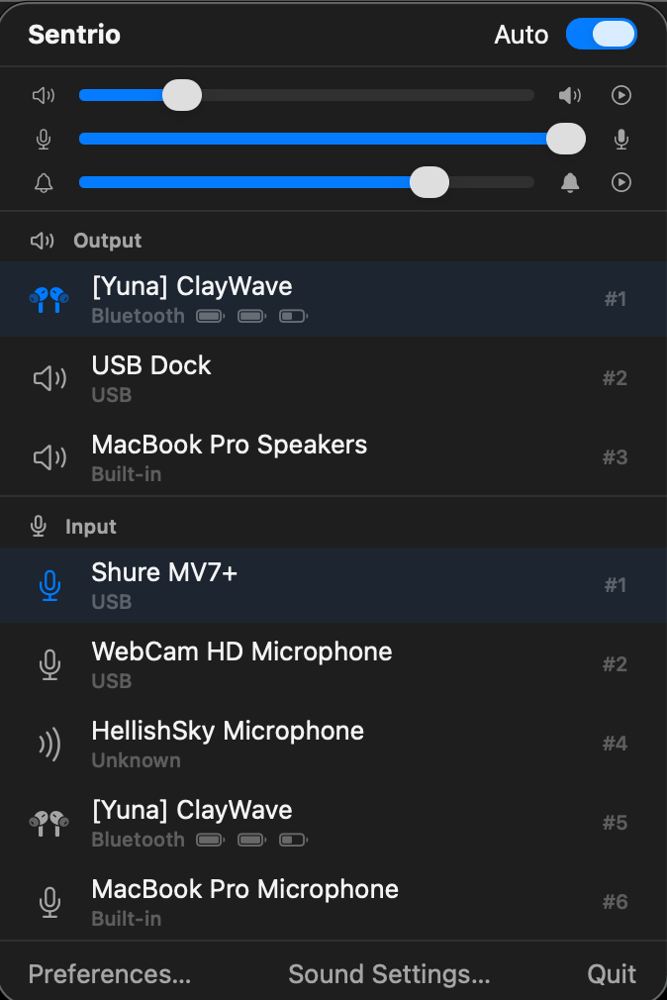
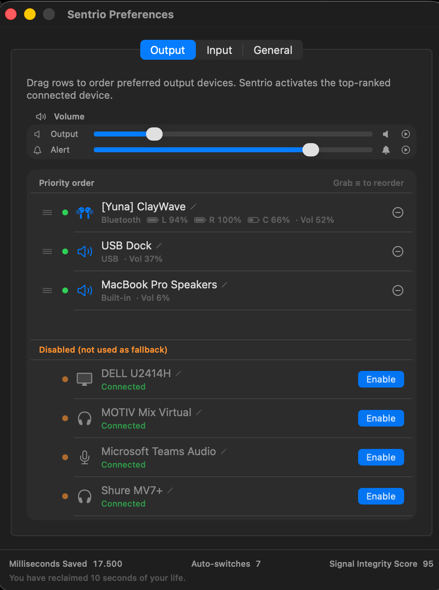

# Sentrio

A lightweight macOS menu bar app that keeps your audio routing and BusyLight behavior predictable.

[](https://github.com/YunaBraska/Sentrio/releases)
[](LICENSE)
[](https://developer.apple.com/macos/)

**Home** | [Getting Started](docs/getting-started/README.md) | [Output + Input](docs/output-input/README.md) | [Settings + Backup](docs/settings-backup/README.md) | [Icons + Names](docs/icons-and-names/README.md) | [BusyLight](docs/busylight/README.md) | [BusyLight HTTP API](docs/busylight-http-api/README.md) | [BusyLight macOS Integrations](docs/busylight-macos-integrations/README.md) | [Troubleshooting](docs/troubleshooting/README.md)

---

## What Sentrio does

- Auto-switches output and input devices based on your priority order
- Restores per-device Output, Input, and Alert volumes
- Supports custom device names and icons
- Shows battery info when macOS exposes it
- Adds BusyLight automation (rules/manual), HTTP control, and macOS integrations
- Includes import/export for settings backup

## Install

### Download (recommended)
1. Open [Releases](https://github.com/YunaBraska/Sentrio/releases)
2. Download the latest zip (`Sentrio-<version>.zip`)
3. Drag `Sentrio.app` into **Applications**
4. First launch: right-click `Sentrio.app` -> **Open**

### Homebrew
```bash
brew tap yunabraska/tap
brew install --cask sentrio
```

## Build from source

```bash
swift build
swift test
./build.sh
open build/Sentrio.app
```

## Screenshots




## Contributing

See [CONTRIBUTING.md](CONTRIBUTING.md).

## License

MIT - see [LICENSE](LICENSE).
