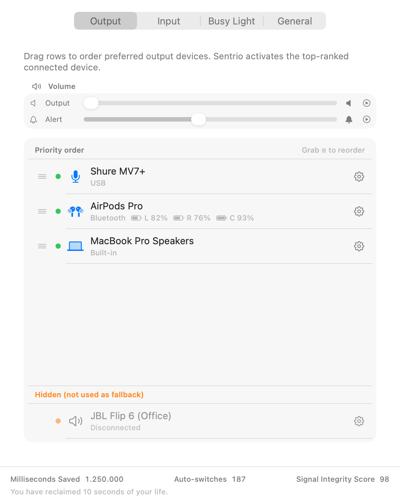
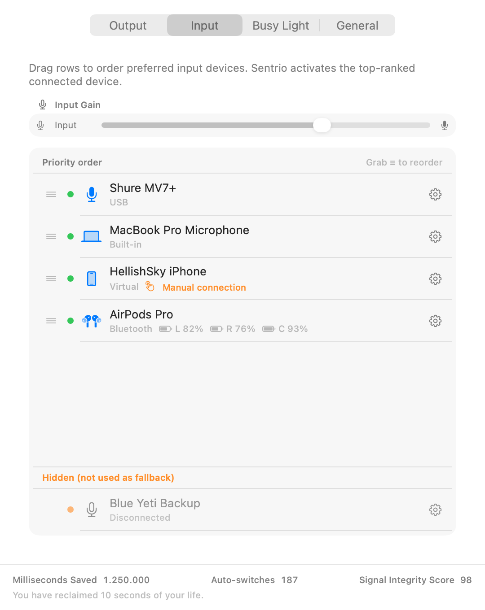

# Output + Input

[Home](../../README.md) | [Getting Started](../getting-started/README.md) | **Output + Input** | [Settings + Backup](../settings-backup/README.md) | [Icons + Names](../icons-and-names/README.md) | [BusyLight](../busylight/README.md) | [BusyLight HTTP API](../busylight-http-api/README.md) | [BusyLight macOS Integrations](../busylight-macos-integrations/README.md) | [Troubleshooting](../troubleshooting/README.md)

This guide explains how audio switching works.

## Core behavior

- Sentrio checks each priority list from top to bottom.
- The first connected, enabled device wins.
- If a device disconnects, Sentrio falls back to the next one.
- Menu priority numbers are shown as contiguous ranks for visible rows (`#1`, `#2`, `#3`, ...), even when grouped/hidden entries exist in stored priority arrays.

## Auto vs manual

- **Auto ON**: Sentrio controls default output/input.
- **Auto OFF**: you select devices manually from the menu panel.
- **Continuity routes (for example iPhone as mic/speaker)**: shown as transport **Continuity** and require explicit **Connect now** user action before they can become active. If that connect attempt fails, Sentrio immediately tries the next eligible device by priority.

## Common actions in Preferences

| Action | Result |
|---|---|
| Drag a row up/down | Changes priority |
| Hide device | Excluded from auto-switch |
| Enable hidden device | Returns device to active list |
| Forget disconnected device (trash) | Removes stored metadata |

## Practical example

Output priority:
1. AirPods Pro
2. USB Interface
3. Built-in Speakers

If AirPods disconnect, USB Interface becomes active. If USB is not connected, Built-in Speakers is used.

## Related docs

- Icons and names: [Icons + Names](../icons-and-names/README.md)
- Troubleshooting: [Troubleshooting](../troubleshooting/README.md)
